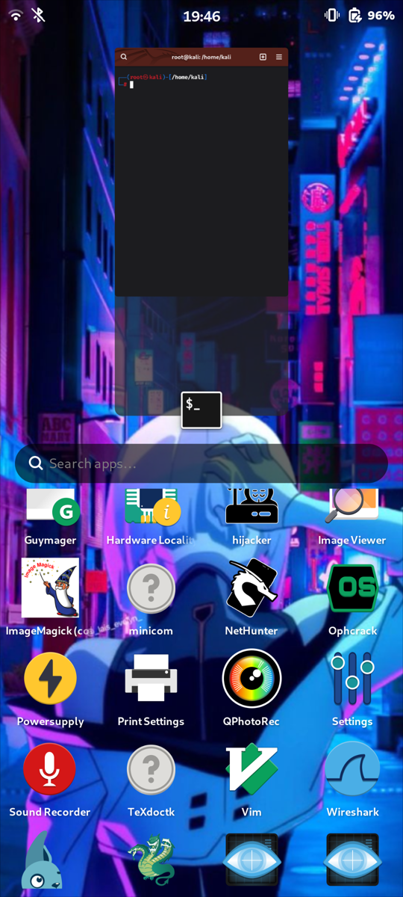
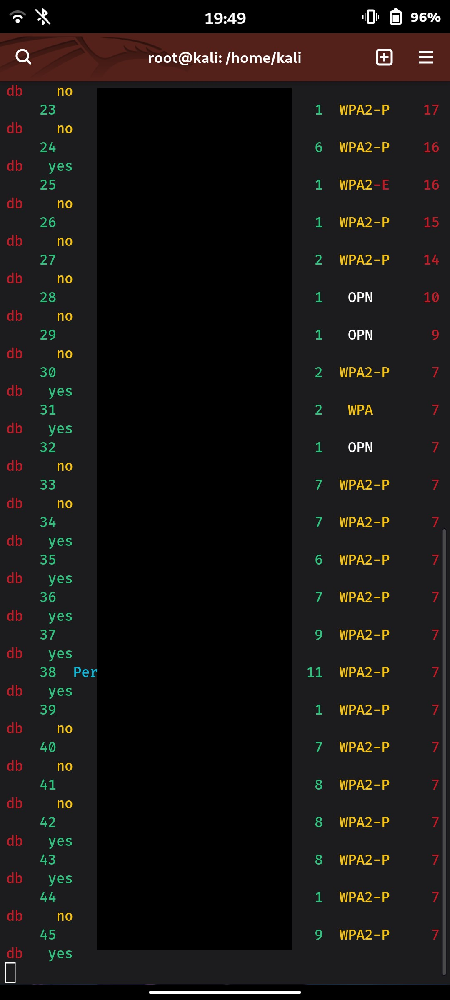

# Build and Flash — the definitive end-to-end guide

> ⚠️ **At your own risk.** The flashing part of this guide can erase data and, in
> rare cases, leave a device unbootable. The authors accept **no liability** —
> see [DISCLAIMER.md](../DISCLAIMER.md). By design the tool never modifies the
> bootloader and only writes declared partitions, so recovery is *normally*
> possible ([recovery.md](recovery.md)) — but not guaranteed. **Back up first.**

This is the complete, accurate walkthrough for taking a device from nothing to a
booted Linux desktop with the **MobileLinux** framework: check → (optional
kernel-config) → build → flash → first boot → test, plus **exactly where every
artifact lands on disk**.

It is written against the real code:
[`core/build.py`](../src/mobilelinux/core/build.py),
[`core/kernel.py`](../src/mobilelinux/core/kernel.py),
[`core/tools.py`](../src/mobilelinux/core/tools.py),
[`core/images.py`](../src/mobilelinux/core/images.py),
[`installer/flash.py`](../src/mobilelinux/installer/flash.py),
the [strategies](../src/mobilelinux/installer/strategies/),
[`ota/release.py`](../src/mobilelinux/ota/release.py), and the flagship device
definition [`devices/motorola/rhodep/device.yaml`](../devices/motorola/rhodep/device.yaml).

For the concepts behind the pieces, see [build.md](build.md),
[flash.md](flash.md), [os-distros.md](os-distros.md),
[kernel-flavors-and-providers.md](kernel-flavors-and-providers.md),
[install.md](install.md), [recovery.md](recovery.md), and
[troubleshooting.md](troubleshooting.md).

---

## Proof it works — Kali on the Moto G82 (`rhodep`)

The whole flow below produces a working system. This is Kali running on a real
Motorola Moto G82 5G (`rhodep`), built and flashed exactly as documented here:






- **Phosh desktop** — Kali (Debian) userland on the mainline 7.2-rc5 kernel,
  Adreno 619 (freedreno/Turnip) compositing.
- **wifite** — live scan using a USB Wi-Fi adapter over OTG (the internal
  WCN3990 can't do monitor mode; USB Wi-Fi injection is exactly what the `kali`
  kernel flavor adds).
- **airmon-ng monitor mode** — the OTG dongle in monitor mode, powered through
  the `rhodep-usb-otg` package (VBUS enabled over I2C via the `otg` helper).

---

## 1. Overview of the full flow

```
 ┌────────┐   ┌───────────────┐   ┌────────┐   ┌────────┐   ┌────────────┐   ┌──────┐
 │ check  │──▶│ kernel-config │──▶│ build  │──▶│ flash  │──▶│ first boot │──▶│ test │
 │(status)│   │  (optional)   │   │        │   │        │   │(resize/DE) │   │      │
 └────────┘   └───────────────┘   └────────┘   └────────┘   └────────────┘   └──────┘
      │              │                 │            │
      │              │                 │            └─ reads out/<device>/artifacts.json,
      │              │                 │               verifies sha256, then writes device
      │              │                 │
      │              │                 └─ writes out/<device>/*.img + artifacts.json + INSTALL.md
      │              │
      │              └─ edits the kernel flavor fragment (Kconfig delta), fed into build
      │
      └─ prints per-subsystem hardware support from device.yaml

 Kernel apk        → ~/.local/var/pmbootstrap/packages/edge/aarch64/<linux_pkg>-<ver>-r0.apk
 pmOS rootfs image → ~/.local/var/pmbootstrap/chroot_native/home/pmos/rootfs/<codename>.img
 Build artifacts   → out/<device>/
 Signed release    → out/releases/<device>/<version>/
```

Commands, in order:

```bash
mobilelinux check   rhodep                       # 0. inspect hardware support (no device needed)
mobilelinux kernel-config rhodep --flavor kali   # 1. optional: tune the kernel delta
mobilelinux build   rhodep --distro kali         # 2. build artifacts into out/rhodep/
mobilelinux flash   rhodep                        # 3. install (auto-picks the strategy)
#                                                    4. first boot resizes rootfs, starts DE
mobilelinux test    rhodep                         # 5. run on-device hardware tests
```

---

## 2. Prerequisites and the execution model

MobileLinux orchestrates heavy external tools (fastboot, adb, debos,
pmbootstrap, mkbootimg, sgdisk, losetup, rauc, openssl, …). Those are often
absent, so the framework **detects each tool**, runs it when present, and
otherwise **prints the exact command it would run** and **tells you what to
install and to re-run**. Nothing destructive ever runs by accident.

### Execution model (from `core/tools.py::Runner`)

| Mode | Flag | Behaviour |
|------|------|-----------|
| **Plan** (default) | *(none)* | Every command is **printed**, nothing runs. |
| **Dry-run** | `--dry-run` | Prints every command, **runs nothing**, always exits cleanly. |
| **Execute** | `--execute` | Runs a command **only if its gating tool is present**; otherwise the command is planned and the missing tool recorded. |
| **Dangerous** | `--allow-dangerous` | *In addition to* `--execute`, permits ops flagged `dangerous` — `losetup`, `mkfs`, GPT partitioning, `chroot` extraction, and `pmbootstrap`. Without it these are always planned, never auto-run. |

The rule (see the `Runner.run` docstring): a command executes only when
`not dry_run AND tool_present AND execute AND not (dangerous without allow_dangerous)`.
This is why merely having `pmbootstrap`/`losetup`/`mkfs` installed can never
cause an accidental long-running or destructive build.

The plan prefixes tell you why a step did not run:

- `[dry-run] <cmd>` — dry-run mode.
- `[skip: tool missing] <cmd>` — the gating tool isn't on `PATH`.
- `[plan: needs --allow-dangerous] <cmd>` — a dangerous op waiting for the flag.
- `[plan: use --execute to run] <cmd>` — present + safe, just not opted in.
- `$ <cmd>` — actually executed.

At the end of any run, **missing tools are summarized with install hints**
(`MissingTools.report()`); install them and re-run the same command. A real
build/flash left with missing tools exits non-zero so scripts can detect it.

### Install-hint table (the real `TOOLS` dict from `core/tools.py`)

| Tool | Purpose | Install hint | Optional |
|------|---------|--------------|:-:|
| `fastboot` | flash/boot Android bootloader partitions | `apt install android-sdk-platform-tools`  (or: pmbootstrap has it bundled) | |
| `adb` | Android Debug Bridge (device detection, adb-shell-dd) | `apt install android-sdk-platform-tools` | |
| `heimdall` | flash Samsung download-mode (Odin) devices | `apt install heimdall-flash` | |
| `uuu` | NXP i.MX serial-download flashing (Librem 5) | download from https://github.com/nxp-imx/mfgtools/releases | |
| `rkdeveloptool` | Rockchip flashing | `apt install rkdeveloptool` | |
| `mkbootimg` | build Android boot images | `apt install android-sdk-libsparse-utils mkbootimg`  (or android-tools) | |
| `img2simg` | convert raw images to Android sparse format | `apt install android-sdk-libsparse-utils` | |
| `debos` | build Debian/Kali rootfs from a recipe | `go install github.com/go-debos/debos/cmd/debos@latest`  (needs Go) | |
| `pmbootstrap` | build mainline kernels/rootfs the postmarketOS way | `pipx install pmbootstrap`  (or: apt install pmbootstrap on some distros) | |
| `mkfs.ext4` | create ext4 filesystems for rootfs images | `apt install e2fsprogs` | |
| `sgdisk` | create GPT partition tables (gpt-in-partition layout) | `apt install gdisk` | |
| `losetup` | attach loop devices for image assembly | `apt install util-linux` (usually preinstalled) | |
| `resize2fs` | grow ext4 filesystems (first-boot resize) | `apt install e2fsprogs` | |
| `rauc` | build/verify/install atomic A/B update bundles | `apt install rauc` | ✓ |
| `openssl` | sign releases and verify signatures | `apt install openssl` | |
| `syft` | generate SBOM (SPDX/CycloneDX) from a rootfs | https://github.com/anchore/syft (curl installer) | ✓ |
| `debsecan` | map installed Debian/Kali packages to CVEs | `apt install debsecan` | ✓ |
| `nc` | stream images to a rescue shell (netcat) | `apt install netcat-openbsd` | |
| `ssh` | stream images / run commands over SSH to a booted device | `apt install openssh-client` | |
| `git` | clone distro build recipes | `apt install git` | |
| `chroot` | run the distro integration phase in the rootfs | `apt install coreutils` (usually preinstalled; needs root) | |
| `go` | build debos (the Debian/Kali rootfs builder) | https://go.dev/dl/ then: go install …/debos@latest | |

Optional tools degrade gracefully (features are skipped, not fatal). Required
tools that are missing block the affected step.

### Preview what a real build needs, without installing anything

```bash
mobilelinux build rhodep --distro kali --dry-run
```

This prints every command for the whole pipeline and, at the end, the exact list
of tools to install for a real build.

---

## 3. Build, per distro

The distro is selected on the command line and is a **swappable layer on top of
the shared device support** — it changes the userland, the rootfs builder, and
the **kernel config flavor**, never the hardware support.

```bash
# Kali (Debian-based): debos rootfs + apk→linux-image.deb kernel handoff
mobilelinux build rhodep --distro kali --desktop phosh --profile security

# postmarketOS (Alpine-based): pmbootstrap install, kernel used as apk directly
mobilelinux build rhodep --distro postmarketos
```

Defaults come from `mobilelinux.toml` `[defaults]` (distro falls back to `kali`,
desktop to `phosh`).

### The pipeline (from `core/build.py::build_command`)

```
kernel (flavor)  →  rootfs (distro backend)  →  rootfs image  →  boot image
                 →  rescue image (if strategy needs one)  →  artifacts.json (+ INSTALL.md)
```

1. **Kernel flavor build** (`core/kernel.py`). The flavor is resolved from the
   distro (`flavors[].distros`): `kali`→`kali` fragment, `postmarketos`→`pmos`
   fragment. On `rhodep` `kernel.build.method: pmbootstrap`, so the framework:
   - merges `base_config + <flavor>.fragment` → the merged config,
   - stages the "active aport" into
     `~/.local/var/pmbootstrap/cache_git/pmaports/device/testing/<linux_pkg>/`,
   - **verifies the flavor discriminator** (`CONFIG_RT2800USB` present ⇒ Kali,
     absent ⇒ pmOS), so you always know which flavor compiled,
   - runs `pmbootstrap checksum` + `pmbootstrap build --force` (both
     **dangerous**; need `--execute --allow-dangerous`).

2. **apk → linux-image.deb** (Debian-family only). Because Kali is
   `family: debian` and the device sets `kernel.build.deb_package: true`, the
   apk is repackaged into a `linux-image-<KVER>.deb` (flat `Image` + appended
   DTB + `/lib/modules/<KVER>`) for debos. pmOS/Alpine **skips this** and uses
   the apk directly. See
   [kernel-flavors-and-providers.md](kernel-flavors-and-providers.md).

3. **Rootfs (distro backend).**
   - **Kali** → **debos**: clone `kali-nethunter-pro` recipes, drop in the
     generated device config + device `.deb`s, run debos → a `nonfree` rootfs
     tarball, then the **device-integration chroot phase** (SoC glue, modem
     services, mask first-boot services, apt holds LAST). See [build.md](build.md).
   - **postmarketOS** → **`pmbootstrap install`**, which produces the rootfs
     image directly (it carries its own boot/root subpartitions). No debos, no
     chroot, no `.deb`.

4. **Rootfs image** (`core/images.py::build_rootfs_image`). For `rhodep`,
   `storage.rootfs_layout: gpt-in-partition` with `rootfs_sector_size: 4096`
   (UFS native 4K): a **full GPT Linux disk** (`p1` boot vfat + `p2` root ext4)
   assembled with `sgdisk`, written *inside* the `userdata` partition. (`plain`
   = single ext4; `whole-disk` = full bootable disk for PinePhone/Librem 5.)

5. **Boot image** (`core/images.py::build_android_bootimg`). For `boot.method:
   android-bootimg`: an **Android boot v2** image (pagesize 4096), built with
   `mkbootimg` using the exact `boot.android_bootimg.offsets`, with the **DTB
   appended to the flat `Image`** (`device_tree.append_dtb: true`) — the
   Motorola ABL requires a flat `Image`, not `Image.gz`.

6. **Rescue image** (only if `install.rescue.required`). For `rhodep`: a pmOS
   kernel+DTB+initramfs with `pmos.debug-shell` appended — USB-gadget networking
   + root shell **without mounting root**. Used by rescue-dd and by recovery.

7. **`artifacts.json` + `INSTALL.md`.** Every produced image is hashed and
   recorded (role, filename, size, sha256). If **no** artifacts were produced
   (tools missing / plan), a device-specific `INSTALL.md` is generated with the
   exact steps.

---

## 4. Where the files land (exact paths)

This is the part people always need. Paths are literal.

### Build output — `out/<device>/` (e.g. `out/rhodep/`)

| File | What it is | Which flash step uses it |
|------|-----------|--------------------------|
| `<device>-boot.img` | Android boot v2 image (flat `Image` + appended DTB, offsets from `boot.android_bootimg`) | `flash-partition boot_a image=boot` (fastboot) |
| `<device>-rootfs.img` | rootfs disk image — for `rhodep`, a GPT-in-partition disk (boot vfat + root ext4), 4096-byte sectors | `dd-partition userdata image=rootfs` (dd over rescue) |
| `<device>-rescue.img` | rescue boot image (pmOS debug-shell), **only if `install.rescue.required`** | `flash-partition boot_a image=rescue` (fastboot) |
| `artifacts.json` | manifest: for each artifact `filename`, `sha256`, `size`, `role` | read + **sha256-verified** by `flash` before any write |
| `INSTALL.md` | generated device-specific install instructions (emitted when no artifacts were built) | reference for manual steps |
| `device.toml` | generated debos device config (chipset/vendor/model + bootimg offsets) | build-time (debos), not a flash input |
| `config-<codename>-<flavor>.aarch64` | merged kernel config (`base + flavor.fragment`), e.g. `config-rhodep-kali.aarch64` | build-time (staged into the aport) |
| `linux-image-*.deb` | repackaged kernel for Debian-family distros (Kali/Debian/Ubuntu only) | build-time (installed into the debos rootfs) |

Exact names for `rhodep` + Kali:

```
out/rhodep/rhodep-boot.img
out/rhodep/rhodep-rootfs.img
out/rhodep/rhodep-rescue.img
out/rhodep/artifacts.json
out/rhodep/INSTALL.md
out/rhodep/device.toml
out/rhodep/config-rhodep-kali.aarch64
out/rhodep/linux-image-7.2.0-rc5_7.2-rc5-rhodep_arm64.deb
```

### pmbootstrap-managed paths (kernel + pmOS rootfs)

| File | Path | Purpose |
|------|------|---------|
| Kernel apk | `~/.local/var/pmbootstrap/packages/edge/aarch64/<linux_pkg>-<ver>-r0.apk` | the built kernel; used directly by pmOS, repackaged to `.deb` for Kali |
| Staged aport | `~/.local/var/pmbootstrap/cache_git/pmaports/device/testing/<linux_pkg>/` | the "active aport swap" — whatever is here is what pmbootstrap builds |
| pmOS rootfs image | `~/.local/var/pmbootstrap/chroot_native/home/pmos/rootfs/<codename>.img` | the pmOS `pmbootstrap install` output (pmOS builds only) |

For `rhodep`, `<linux_pkg>` = `linux-motorola-rhodep`, so the apk is e.g.
`~/.local/var/pmbootstrap/packages/edge/aarch64/linux-motorola-rhodep-7.2_rc5-r0.apk`
and the pmOS rootfs image is
`~/.local/var/pmbootstrap/chroot_native/home/pmos/rootfs/rhodep.img`.

### Release output — `out/releases/<device>/<version>/`

| File | What it is |
|------|-----------|
| `manifest.json` | signed OTA manifest (device id/arch/min-version + per-artifact `url`/`sha256`/`size`/`type`, security block) |
| `sbom.cyclonedx.json` | CycloneDX SBOM generated from the rootfs |
| copied artifacts | the `<device>-boot.img` / `<device>-rootfs.img` / etc. referenced by the manifest, `cp`'d in from `out/<device>/` |

Example: `out/releases/rhodep/1.0.0/{manifest.json,sbom.cyclonedx.json,rhodep-boot.img,rhodep-rootfs.img}`.
The release **never** embeds private keys; publishing is a separate upload step.

---

## 5. Flash, per strategy

`mobilelinux flash <device>` **auto-selects** the strategy from
`install.strategy` — you never pass it. It enforces the 10-rule safety contract
(`installer/flash.py`): verify artifact hashes → detect device → confirm
codename/model → show the plan → require confirmation → support `--dry-run` →
**abort on a mismatched device** (`SafetyAbort`) → offer rescue/recovery.

### What each of the 6 strategies moves, and where

| Strategy | Artifact → target | Mechanism |
|----------|-------------------|-----------|
| **rescue-dd** | `rescue`→`boot_a`, then `rootfs`→`userdata`, then `boot`→`boot_a` | `fastboot flash` for boot slots; **`dd` of the rootfs GPT disk into `userdata`** streamed over the rescue transport (telnet+`nc`, or `ssh`). For devices whose bootloader denies `fastboot flash userdata` and have no fastbootd (e.g. `rhodep`). |
| **fastboot** | `boot`→boot partition, `rootfs`→rootfs partition | plain `fastboot flash <part> ` — bootloader can write the rootfs directly (e.g. OnePlus 6). |
| **fastbootd** | same as fastboot but for logical/dynamic (super) partitions | reboots into **userspace fastboot** first, then `fastboot flash` (e.g. Pixel 3a). |
| **heimdall** | `boot`/`rootfs` → named partitions | `heimdall flash --<part> `; **no A/B slots**; reboot via `heimdall close-pc-screen` (e.g. Galaxy S III). |
| **sdcard** | whole-disk `rootfs` image → SD/eMMC | host-side write to a target you must pass via `--target`; **refuses to guess**; boot is part of the disk image (e.g. PinePhone). |
| **uuu** | `rootfs` image → eMMC | `uuu ` serial download; boot handled by the uuu script/disk image; no A/B slots (e.g. Librem 5). |

(There is also `adb-shell-dd`: `adb shell 'su -c "dd of=/dev/disk/by-partlabel/<part> ..."' < img`
for partitions written from a booted Linux/recovery.)

### Full walkthrough — `rhodep` rescue-dd (the flagship)

`rhodep`'s `userdata` **cannot** be written by fastboot — `fastboot flash
userdata` is denied by the Motorola ABL, and there is no fastbootd. This is **by
design**, not a bug. The `install.steps` in
[`device.yaml`](../devices/motorola/rhodep/device.yaml) drive the flow.

**Step 0 — build the artifacts (including the rescue image).** The rescue base
boot image is non-redistributable, so supply a known-good pmOS `boot.img`:

```bash
mobilelinux build rhodep --distro kali --input-boot-img /path/to/pmos-boot.img
```

This produces `out/rhodep/rhodep-rescue.img` (plus `-boot.img`, `-rootfs.img`,
`artifacts.json`).

**Step 1 — preview the plan (writes nothing):**

```bash
mobilelinux flash rhodep --dry-run
```

You'll see the verified artifacts, the strategy, and each planned op with
destructive ones marked, e.g.:

```
artifacts verified (3 files, sha256 ok)
Flash plan
  strategy: rescue-dd
    - rescue-dd: userdata cannot be written by fastboot on this device
    - Flash the rescue image to the boot slot [destructive]
    - (set active slot a)
    - reboot
    - wait for rescue transport telnet://172.16.42.1:23 (boot into rescue image)
    - stream rootfs -> /dev/disk/by-partlabel/userdata over netcat (rescue telnet 172.16.42.1:23) [destructive]
    - Flash the distro boot image [destructive]
    - (set active slot a)
    - reboot
    - First boot resizes the rootfs and starts the desktop
  rescue available: pmos-debug-shell @ telnet://172.16.42.1:23
```

**Step 2 — the WARNING / confirmation block.** With the device in fastboot mode,
run the real flash. Before any write, `flash` prints:

```
WARNING

Device detected:
  Motorola Moto G82 5G (rhodep)

This operation will modify:
  boot_a
  userdata

Installation strategy:
  rescue-dd

Continue? [y/N]
```

`flash` first verifies **codename/model** against the definition and **aborts if
another device is connected** (won't run rhodep's commands on a non-rhodep). It
also **verifies every artifact's sha256** against `artifacts.json` and refuses to
flash on any mismatch.

**Step 3 — the sequence that runs on confirmation:**

1. `fastboot flash boot_a out/rhodep/rhodep-rescue.img` — flash the rescue image.
2. `fastboot --set-active=a` — set active slot `a`.
3. `fastboot reboot` — boot into the rescue image.
4. **Wait for `telnet://172.16.42.1:23`** — the rescue env brings up USB-gadget
   networking + a root shell **without mounting root**.
5. **`dd` the rootfs into `userdata`.** telnet can't stream binary reliably, so
   the rescue shell opens a netcat listener and the host pipes the image in:
   ```
   # inside the rescue shell:  nc -l -p 5555 | dd of=/dev/disk/by-partlabel/userdata bs=4M conv=fsync
   nc 172.16.42.1 5555 < out/rhodep/rhodep-rootfs.img
   ```
   (The target path `/dev/disk/by-partlabel/userdata` comes from
   `storage.partitions`. If the transport were `ssh://user@host`, it would be
   `ssh -t user@host 'sudo dd of=… bs=4M conv=fsync' < rhodep-rootfs.img`.)
6. `fastboot flash boot_a out/rhodep/rhodep-boot.img` — flash the Kali boot image.
7. `fastboot --set-active=a` — set active slot `a`.
8. `fastboot reboot`.
9. **First boot** masks `droid-juicer`/`systemd-repart`, **resizes the ext4
   rootfs** to fill `userdata` (`first_boot.resize_rootfs: true`), and starts
   Phosh.

**Hash verification** happens at load time (`ArtifactSet.verify`); a mismatch
prints `✗ <key>: sha256 mismatch …` and refuses to flash. If a step's tool is
missing (e.g. `nc`), it's skipped, reported with an install hint, and `flash`
exits non-zero so you can install and re-run.

The same rescue environment is reused for **recovery** (`mobilelinux flash
rhodep --recovery`); see [recovery.md](recovery.md).

---

## 6. First boot + verification

**First boot** (no host action) resizes the rootfs and starts the desktop, per
`first_boot` in the device definition.

**On-device hardware tests** — run `mobilelinux test` on the booted phone:

```bash
mobilelinux test rhodep                 # run all declared tests
mobilelinux test rhodep --only wifi,gpu # run a subset
```

`rhodep` declares tests for boot, display, touch, gpu, storage, usb, wifi,
bluetooth, audio, battery, charging, modem, gnss, nfc, sensors, vibrator.

**Static support check** — no device needed, reads the definition:

```bash
mobilelinux check rhodep
```

It prints per-subsystem status (`supported`/`partial`/`broken`/`untested`) with
the evidence and caveats recorded in `device.yaml`. See [testing.md](testing.md).

---

## 7. Release + OTA (quick pointer)

Cut a signed, reproducible release from the built artifacts:

```bash
mobilelinux release rhodep --version 1.0.0            # channel defaults per config
mobilelinux keygen --channel stable                   # if you don't have a signing key yet
```

This writes `out/releases/rhodep/1.0.0/` containing `manifest.json` (signed with
`keys/<channel>.ed25519.key` if present, else UNSIGNED with a hint),
`sbom.cyclonedx.json`, and the copied artifacts. Publishing = uploading that
directory as release assets (GitHub Releases / static HTTP); the client only
needs the manifest URL + public key.

Then, **on the device**, apply updates over the A/B OTA flow:

```bash
mobilelinux update
```

Full details: [release-process.md](release-process.md) and [ota.md](ota.md).

---

## See also

- [install.md](install.md) — the full user path, start to finish
- [build.md](build.md) — the build pipeline in depth
- [flash.md](flash.md) — the flasher and its safety contract
- [os-distros.md](os-distros.md) — Kali vs postmarketOS backends
- [kernel-flavors-and-providers.md](kernel-flavors-and-providers.md) — the shared
  kernel base + per-distro flavor delta (and the apk→.deb handoff)
- [recovery.md](recovery.md) — the rescue flow when a device won't boot
- [troubleshooting.md](troubleshooting.md) — device-mismatch aborts, missing
  tools, verification failures
